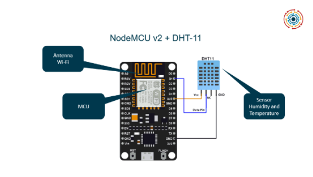

## ESP32 to Helix 
#### About

The code below automatically creates the sensor in the Helix Sandbox and sends the temperature and humidity from DHT-11 to Helix using the restful message with the POST method. Moreover, this code uses the force update to guarantee the storage persistence on the database. 
You can use the Arduino IDE to create the code for your NodeMCU.

#### Electrical Diagram



#### Code

```C++
#include <WiFi.h>
#include <HTTPClient.h>
#include <DHT.h>
#include <math.h>

// Setting DHT Configuration
#define DHTPIN D1          // Digital pin connected to the DHT sensor
#define DHTTYPE DHT11     // DHT 11
DHT dht(DHTPIN, DHTTYPE); // Initialing DHT Class

// WiFi Network Configuration
const char *ssid = "SSID";
const char *password = "PASSWORD";
const char *hostname = "ESP32";

//Helix IP Address
const char *orionAddressPath = "IP_HELIX:1026/v2";

// Device ID (example: urn:ngsi-ld:entity:001)
const char *deviceID = "ID_DEVICE";

HTTPClient http;
#define LED_BUILTIN 2

void setup()
{
    Serial.begin(115200);
    Serial.println("\nBootting...");
    pinMode(LED_BUILTIN, OUTPUT);

    dht.begin();

    setupWiFi();
}

void setupWiFi()
{
    WiFi.mode(WIFI_STA);
    WiFi.setHostname(hostname);
    WiFi.begin(ssid, password);
    Serial.print("Connecting to WiFi ..");
    while (WiFi.status() != WL_CONNECTED)
    {
        Serial.print('.');
        delay(50);
    }
    Serial.print("\n IP: " + WiFi.localIP());
    Serial.println(WiFi.localIP());
}

void loop()
{
    float totalTemperature = 0;
    float totalHumidity = 0;

    for (short i = 0; i < 5; i++)
    {
        // Wait a few seconds before measurements
        delay(5000);

        float actualTemperature = dht.readTemperature(false);
        // Wait a few seconds between measurements
        delay(10);
        float actualHumidity = dht.readHumidity();

        if (isnan(actualTemperature))
        {
            actualTemperature = 0;
        }
        if (isnan(actualHumidity))
        {
            actualHumidity = 0;
        }

        totalHumidity += actualHumidity;
        totalTemperature += actualTemperature;

        Serial.print("COUNT[" + String(i + 1) + "] - ");
        Serial.print("Humidity: " + String(actualHumidity) + "% - ");
        Serial.print("Total Humidity: " + String(totalHumidity) + "°C  - ");
        Serial.print("Temperature: " + String(actualTemperature) + "°C - ");
        Serial.println("Total Temperature: " + String(totalTemperature) + "°C");
    }

    // Calculation of average values
    short medianTemperature = totalTemperature / 5;
    short medianHumidity = totalHumidity / 5;

    Serial.println("Median after 5 reads is Humidity: " + String(medianHumidity) + "% - Temperature: " + String(medianTemperature) + "°C");

    char msgHumidity[10];
    char msgTemperature[10];
    sprintf(msgHumidity, "%d", medianHumidity);
    sprintf(msgTemperature, "%d", medianTemperature);

    // Update
    Serial.println("Updating data in orion...");
    orionUpdate(deviceID, msgTemperature, msgHumidity);

    // Luminous feedback
    digitalWrite(LED_BUILTIN, HIGH); // turn the LED on (HIGH is the voltage level)
    delay(500);
    digitalWrite(LED_BUILTIN, LOW); // turn the LED off by making the voltage LOW
    delay(500);
    Serial.println("Finished updating data in orion...");
}

// Request Helper
void httpRequest(String path, String data)
{
    String payload = makeRequest(path, data);

    if (!payload)
    {
        return;
    }

    Serial.println("##[RESULT]## ==> " + payload);
}

// Request Helper
String makeRequest(String path, String bodyRequest)
{
    String fullAddress = "http://" + String(orionAddressPath) + path;
    http.begin(fullAddress);
    Serial.println("Orion URI request: " + fullAddress);

    http.addHeader("Content-Type", "application/json");
    http.addHeader("Accept", "application/json");
    http.addHeader("fiware-service", "helixiot");
    http.addHeader("fiware-servicepath", "/");

    Serial.println(bodyRequest);
    int httpCode = http.POST(bodyRequest);

    String response = http.getString();

    Serial.println("HTTP CODE");
    Serial.println(httpCode);

    if (httpCode < 0)
    {
        Serial.println("request error - " + httpCode);
        return "";
    }

    if (httpCode != HTTP_CODE_OK)
    {
        return "";
    }

    http.end();

    return response;
}

// Creating the device in the Helix Sandbox (plug&play)
void orionCreateEntity()
{
    Serial.println("Creating " + String(deviceID) + " entity...");
    String bodyRequest = "{\"id\": \"" + String(deviceID) + "\", \"type\": \"iot\", \"temperature\": { \"value\": \"0\", \"type\": \"integer\"},\"humidity\": { \"value\": \"0\", \"type\": \"integer\"}}";
    httpRequest("/entities", bodyRequest);
}

// Update Values in the Helix Sandbox
void orionUpdate(String entityID, String temperature, String humidity)
{
    String bodyRequest = "{\"temperature\": { \"value\": \"" + temperature + "\", \"type\": \"float\"}, \"humidity\": { \"value\": \"" + humidity + "\", \"type\": \"float\"}}";
    String pathRequest = "/entities/" + entityID + "/attrs?options=forcedUpdate";
    httpRequest(pathRequest, bodyRequest);
}
```
Enjoy and explore all Helix features with NodeMCU.
#### © Helix Platform 2020, All rights reserved.
