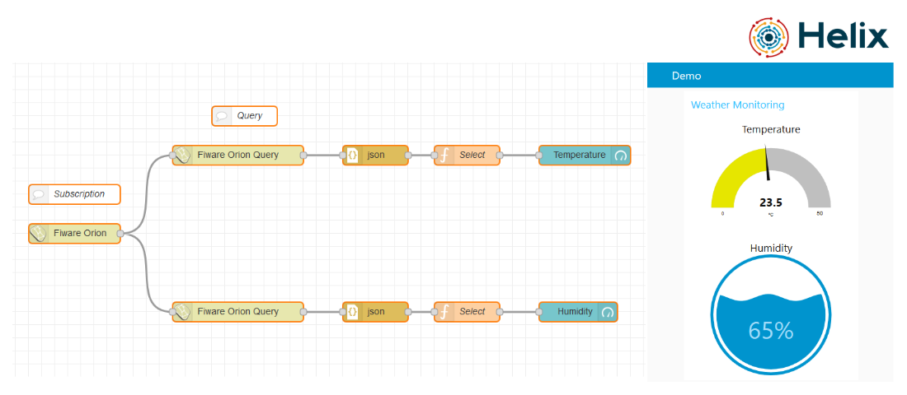

## Dashboard with Node-RED

### About

This how-to can help you create a simple dashboard to view the temperature and humidity transmitted by your NodeMCU to the Helix Sandbox and also details the installation of Node-RED on the server.



Good luck!

### Create the Ubuntu Server base image

   Log in to your Cloud Service Provider (CSP)

   Click to add a New … Virtual Machine

   In the list of Virtual Machines, select Ubuntu Server, then click ‘Create’

   Give your machine a name, the username you want to use and the authentication details you want to use to access
   the instance.
   Choose the Size of your instance. Remember that node.js is single-threaded so there’s no benefit to picking a size with
   multiple cores for a simple node-red instance.
   Add a new ‘Inbound rule’ with the options set as:
       Name: node-red
       Protocol: TCP
       Destination port range: 1880

### Setup Node-RED

The next task is to log into the instance then install node.js and Node-RED.

Log into your instance using the authentication details you specified in the previous stage.

Once logged in you need to install node.js and Node-RED

```
   curl -sL https://deb.nodesource.com/setup_10.x | sudo -E bash -
   sudo apt-get install -y nodejs build-essential
   sudo npm install -g --unsafe-perm node-red
```

At this point you can test your instance by running node-red. Note: you may get some errors regarding the Serial node - that’s to be expected and can be ignored.

Once started, you can access the editor at http://[IP]:1880

To get Node-RED to start automatically whenever your instance is restarted, you can use pm2:
```
   sudo npm install -g --unsafe-perm pm2
   pm2 start `which node-red` -- -v
   pm2 save
   pm2 startup
```
Note: this final command will prompt you to run a further command - make sure you do as it says.

### Importing the Weather Monitoring Flow

Import the <a href="https://github.com/Helix-Platform/Sandbox-NG/blob/master/node_red_flow/weather_monitoring.json">file</a> into Node-RED, configure the Helix address in the properties of the Fiware Orion and Fiware Orion Query nodes. Click on Deploy to have Node-RED build the panel and subscribes the CEF Context Broker.

You can use your NodeMCU or create an entity in CEF Context Broker using this Postman <a href="https://github.com/Helix-Platform/Sandbox-NG/blob/master/postman/helix_with_node-red_postman_collection.json">collection</a>.

Enjoy your dashboard and explore all Helix features with Node-RED.
#### © Helix Platform 2020, All rights reserved.
<a href="https://gethelix.org">Helix</a> for a better world! 
