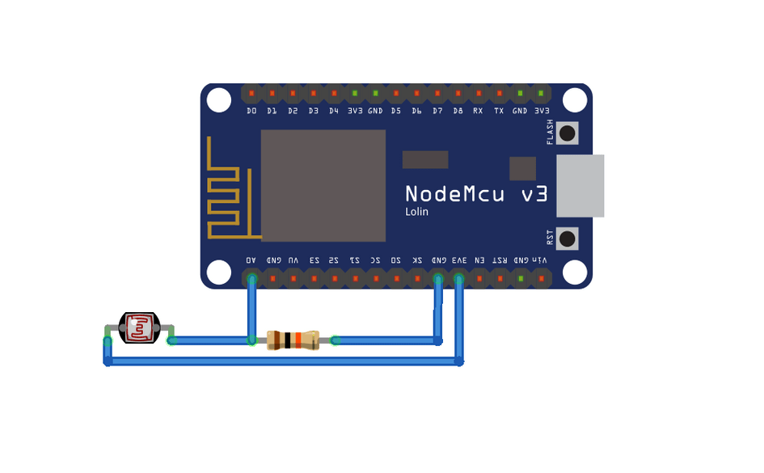

## NodeMCU with LED + LDR Sensor
#### About

The code below automatically creates the sensor and actuator in the Helix Sandbox and sends the luminosity from LDR and LED state to Helix using the MQTT messages. Moreover, this code uses the force update to guarantee the storage persistence on the database. 
You can use the Arduino IDE to create the code for your NodeMCU.

#### Use the MQTT Tutorial for this lab!

Click <a href="https://github.com/Helix-Platform/Sandbox-NG/blob/master/postman/Go Helix! MQTT new.postman_collection.json">here</a> to access the Postman collection! 

#### Electrical Diagram



#### Code

```//Programa: NodeMCU e MQTT - Controle e Monitoramento IoT
//Autor: Fábio Henrique Cabrini
//Resumo: Esse programa possibilita ligar e desligar o led onboard, além de mandar o status para o Broker MQTT possibilitando o Helix saber
//se o led está ligado ou desligado.
 
#include <ESP8266WiFi.h> // Importa a Biblioteca ESP8266WiFi
#include <PubSubClient.h> // Importa a Biblioteca PubSubClient
 
//defines:
//defines de id mqtt e tópicos para publicação e subscribe
#define TOPICO_SUBSCRIBE "/iot/lamp001/cmd"     //tópico MQTT de escuta
#define TOPICO_PUBLISH   "/iot/lamp001/attrs"    //tópico MQTT de envio de informações para Broker
#define TOPICO_PUBLISH_2   "/iot/lamp001/attrs/l"    //tópico MQTT de envio de informações para Broker
                                                   //IMPORTANTE: recomendamos fortemente alterar os nomes
                                                   //            desses tópicos. Caso contrário, há grandes
                                                   //            chances de você controlar e monitorar o NodeMCU
                                                   //            de outra pessoa.
#define ID_MQTT  "helix"     //id mqtt (para identificação de sessão)
                               //IMPORTANTE: este deve ser único no broker (ou seja, 
                               //            se um client MQTT tentar entrar com o mesmo 
                               //            id de outro já conectado ao broker, o broker 
                               //            irá fechar a conexão de um deles).
                                
 
//defines - mapeamento de pinos do NodeMCU
#define D0    16
#define D1    5
#define D2    4
#define D3    0
#define D4    2
#define D5    14
#define D6    12
#define D7    13
#define D8    15
#define D9    3
#define D10   1
 
 
// WIFI
const char* SSID = "SSID"; // SSID / nome da rede WI-FI que deseja se conectar
const char* PASSWORD = "PASSWORD"; // Senha da rede WI-FI que deseja se conectar
  
// MQTT
const char* BROKER_MQTT = "IP"; //URL do broker MQTT que se deseja utilizar
int BROKER_PORT = 1883; // Porta do Broker MQTT
 

//Variáveis e objetos globais
WiFiClient espClient; // Cria o objeto espClient
PubSubClient MQTT(espClient); // Instancia o Cliente MQTT passando o objeto espClient
char EstadoSaida = '1';  //variável que armazena o estado atual da saída
  
//Prototypes
void initSerial();
void initWiFi();
void initMQTT();
void reconectWiFi(); 
void mqtt_callback(char* topic, byte* payload, unsigned int length);
void VerificaConexoesWiFIEMQTT(void);
void InitOutput(void);
 
/* 
 *  Implementações das funções
 */
void setup() 
{
    //inicializações:
    InitOutput();
    initSerial();
    initWiFi();
    initMQTT();
    delay(5000);
    MQTT.publish(TOPICO_PUBLISH, "s|off");
}
  
//Função: inicializa comunicação serial com baudrate 115200 (para fins de monitorar no terminal serial 
//        o que está acontecendo.
//Parâmetros: nenhum
//Retorno: nenhum
void initSerial() 
{
    Serial.begin(115200);
}
 
//Função: inicializa e conecta-se na rede WI-FI desejada
//Parâmetros: nenhum
//Retorno: nenhum
void initWiFi() 
{
    delay(10);
    Serial.println("------Conexao WI-FI------");
    Serial.print("Conectando-se na rede: ");
    Serial.println(SSID);
    Serial.println("Aguarde");
     
    reconectWiFi();
}
  
//Função: inicializa parâmetros de conexão MQTT(endereço do 
//        broker, porta e seta função de callback)
//Parâmetros: nenhum
//Retorno: nenhum
void initMQTT() 
{
    MQTT.setServer(BROKER_MQTT, BROKER_PORT);   //informa qual broker e porta deve ser conectado
    MQTT.setCallback(mqtt_callback);            //atribui função de callback (função chamada quando qualquer informação de um dos tópicos subescritos chega)
}
  
//Função: função de callback 
//        esta função é chamada toda vez que uma informação de 
//        um dos tópicos subescritos chega)
//Parâmetros: nenhum
//Retorno: nenhum
void mqtt_callback(char* topic, byte* payload, unsigned int length) 
{
    String msg;
 
    //obtem a string do payload recebido
    for(int i = 0; i < length; i++) 
    {
       char c = (char)payload[i];
       msg += c;
    }
   
    //toma ação dependendo da string recebida:
    //verifica se deve colocar nivel alto de tensão na saída D0:
    //IMPORTANTE: o Led já contido na placa é acionado com lógica invertida (ou seja,
    //enviar HIGH para o output faz o Led apagar / enviar LOW faz o Led acender)
    if (msg.equals("lamp001@on|"))
    {
        digitalWrite(D4, LOW);
        EstadoSaida = '0';
    }
 
    //verifica se deve colocar nivel alto de tensão na saída D0:
    if (msg.equals("lamp001@off|"))
    {
        digitalWrite(D4, HIGH);
        EstadoSaida = '1';
    }
     
}
  
//Função: reconecta-se ao broker MQTT (caso ainda não esteja conectado ou em caso de a conexão cair)
//        em caso de sucesso na conexão ou reconexão, o subscribe dos tópicos é refeito.
//Parâmetros: nenhum
//Retorno: nenhum
void reconnectMQTT() 
{
    while (!MQTT.connected()) 
    {
        Serial.print("* Tentando se conectar ao Broker MQTT: ");
        Serial.println(BROKER_MQTT);
        if (MQTT.connect(ID_MQTT)) 
        {
            Serial.println("Conectado com sucesso ao broker MQTT!");
            MQTT.subscribe(TOPICO_SUBSCRIBE); 
        } 
        else
        {
            Serial.println("Falha ao reconectar no broker.");
            Serial.println("Havera nova tentatica de conexao em 2s");
            delay(2000);
        }
    }
}
  
//Função: reconecta-se ao WiFi
//Parâmetros: nenhum
//Retorno: nenhum
void reconectWiFi() 
{
    //se já está conectado a rede WI-FI, nada é feito. 
    //Caso contrário, são efetuadas tentativas de conexão
    if (WiFi.status() == WL_CONNECTED)
        return;
         
    WiFi.begin(SSID, PASSWORD); // Conecta na rede WI-FI
     
    while (WiFi.status() != WL_CONNECTED) 
    {
        delay(100);
        Serial.print(".");
    }
   
    Serial.println();
    Serial.print("Conectado com sucesso na rede ");
    Serial.print(SSID);
    Serial.println("IP obtido: ");
    Serial.println(WiFi.localIP());
}
 
//Função: verifica o estado das conexões WiFI e ao broker MQTT. 
//        Em caso de desconexão (qualquer uma das duas), a conexão
//        é refeita.
//Parâmetros: nenhum
//Retorno: nenhum
void VerificaConexoesWiFIEMQTT(void)
{
    if (!MQTT.connected()) 
        reconnectMQTT(); //se não há conexão com o Broker, a conexão é refeita
     
     reconectWiFi(); //se não há conexão com o WiFI, a conexão é refeita
}
 
//Função: envia ao Broker o estado atual do output 
//Parâmetros: nenhum
//Retorno: nenhum
void EnviaEstadoOutputMQTT(void)
{
    if (EstadoSaida == '0')
      MQTT.publish(TOPICO_PUBLISH, "s|on");
 
    if (EstadoSaida == '1')
      MQTT.publish(TOPICO_PUBLISH, "s|off");
 
    Serial.println("- Estado do LED onboard enviado ao broker!");
    delay(1000);
}
 
//Função: inicializa o output em nível lógico baixo
//Parâmetros: nenhum
//Retorno: nenhum
void InitOutput(void)
{
    //IMPORTANTE: o Led já contido na placa é acionado com lógica invertida (ou seja,
    //enviar HIGH para o output faz o Led apagar / enviar LOW faz o Led acender)
    pinMode(D4, OUTPUT);
    digitalWrite(D4, HIGH);          
}
 
 
//programa principal
void loop() 
{   
    char msgBuffer[1];
    //garante funcionamento das conexões WiFi e ao broker MQTT
    VerificaConexoesWiFIEMQTT();
 
    //envia o status de todos os outputs para o Broker no protocolo esperado
    EnviaEstadoOutputMQTT();

    //luminosidade
    int sensorValue = analogRead(A0);   // Ler o pino Analógico A0 onde está o LDR
    float voltage = sensorValue * (3.3 / 1024.0);   // Converter a leitura analógica (que vai de 0 - 1023) para uma voltagem (0 - 3.3V), quanto de acordo com a intensidade de luz no LDR a voltagem diminui.
    Serial.println(voltage);
    MQTT.publish(TOPICO_PUBLISH_2,dtostrf(voltage, 4, 2, msgBuffer));
    //keep-alive da comunicação com broker MQTT
    MQTT.loop();
}
```
Enjoy and explore all Helix features with NodeMCU.
#### © Helix Platform 2022, All rights reserved.
